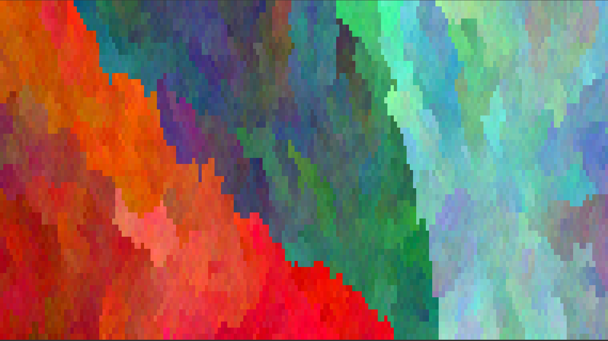

# huegene-rs

A program that makes your terminal display pretty colors.

This is losely based off TodePond's cellular automata video [here](https://youtu.be/WMJ1H3Ai-qs?si=Bd288SeOE-5x-WYE&t=603).

### Running

Clone the repo, and type `cargo run --release` in the root directory and enjoy. Press q to quit the program.